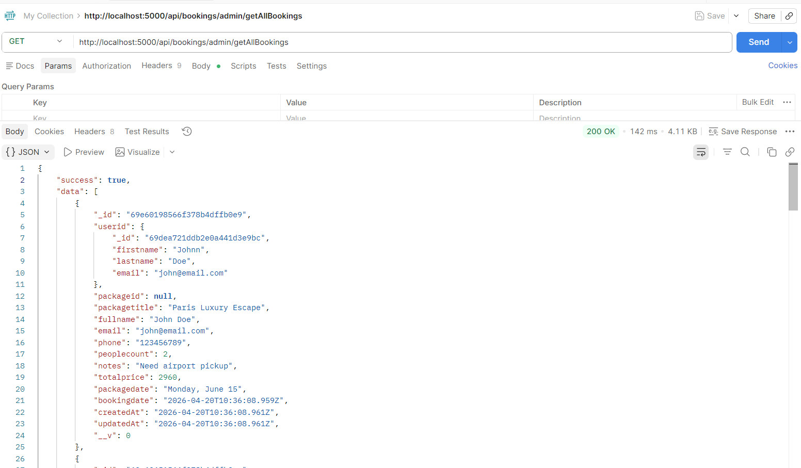
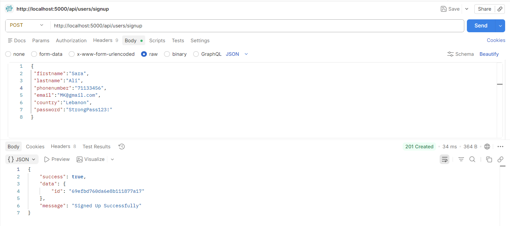
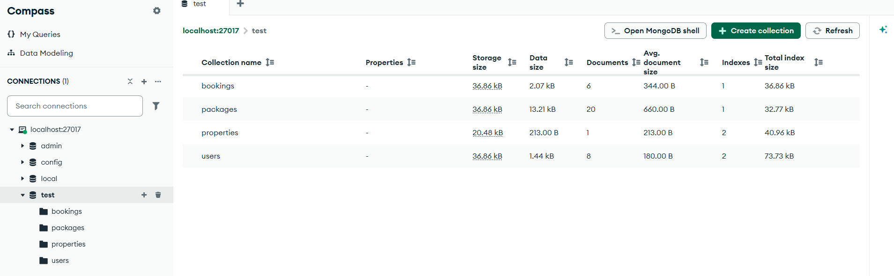
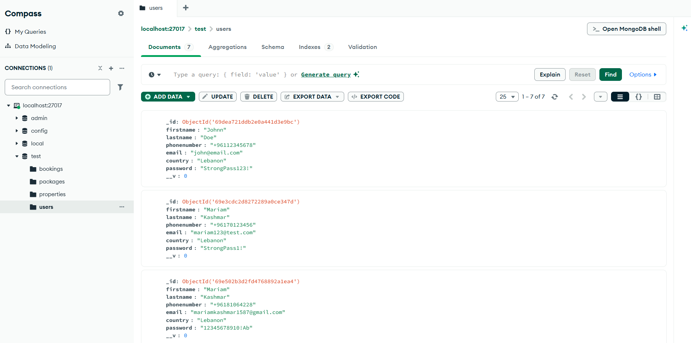
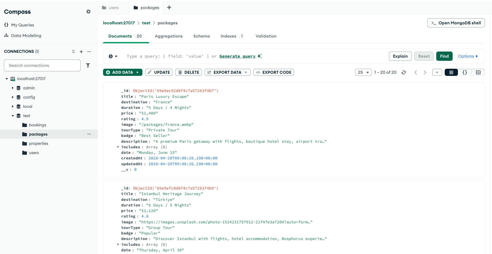
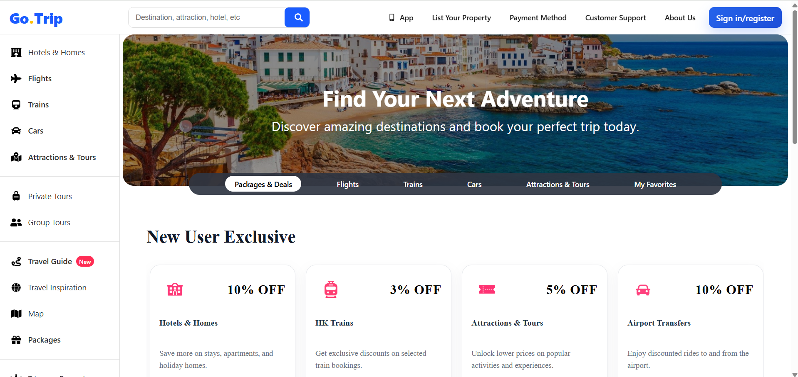
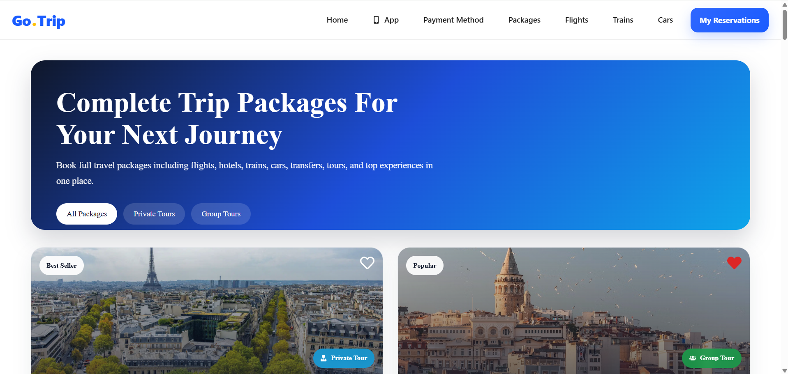
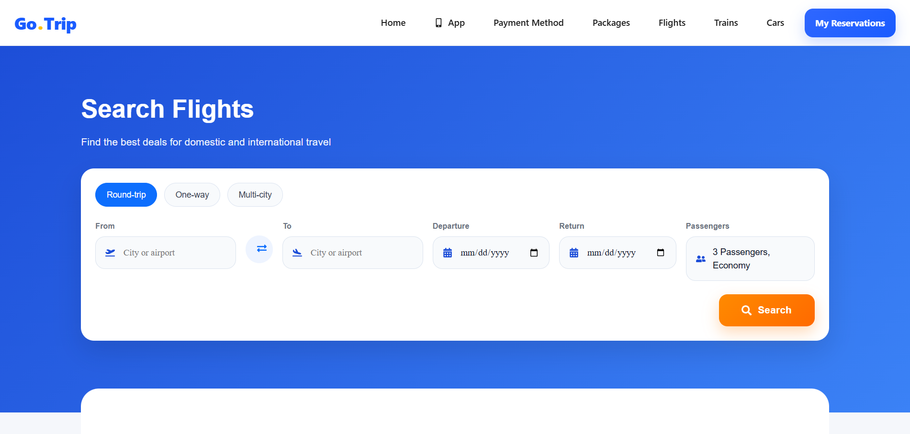
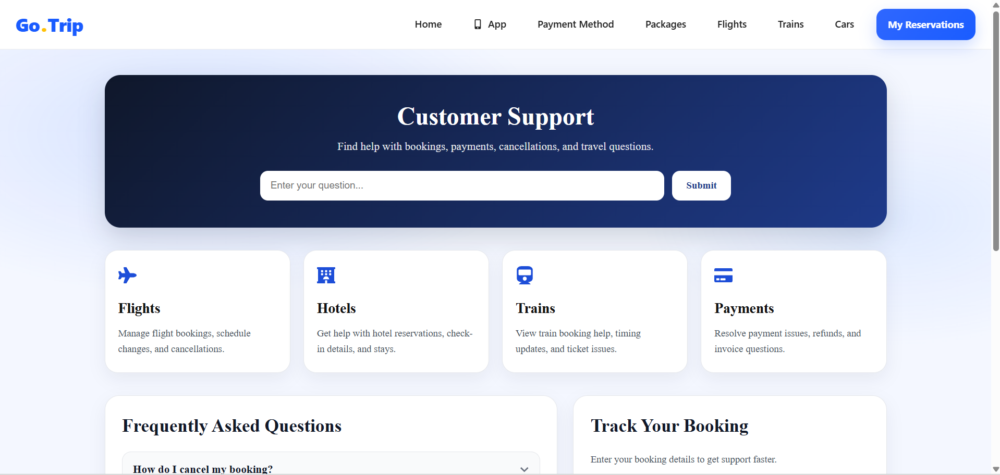

# 🌍 Travel Booking System

A modern and responsive travel booking web application built with **React.js**.
The website allows users to explore travel services, browse travel packages, save favorite trips, and manage their reservations in one place.

This project focuses on creating a **clean, user-friendly, and responsive interface** for travelers who want to plan their trips easily.

---

# ✨ Features
## User Features

* ✈️ Flights booking page
* 🚆 Trains booking page
* 🚗 Car rental page
* 🏨 Hotels and travel packages
* ❤️ Favorites system for saved trips
* 🧭 Travel guides section
* 📅 Reservation page
* ❓ Customer support and FAQ section
* 🗺️ Google Maps integration
* 🔐 Sign In / Sign Up pages
* 📱 Fully responsive design

---

## Backend Features
*🔐 User authentication system
*📦 Travel package management
*📅 Booking system
*🧾 Store bookings in database
*🔄 API communication between frontend and backend
*🗄️ MongoDB database integration

---

# 🛠️ Technologies Used
## Frontend

* React.js
* JavaScript (ES6+)
* HTML5
* CSS3
* React Router
* React Icons
* Axios
  
---
## Backend
* Node.js
* Express.js
* MongoDB
* Mongoose

---

## 🧪 API Testing
* Postman
* All API endpoints were tested using Postman before integrating them with the frontend.
  
### To get all bookings:  



### Signing Up:



---

## 💾 Database
* For database, MongoDB Compass was used.
* Connect to localhost:27017
  
### Database Structure:


### Users:


### Packages:



  
# 📂 Project Structure
```

MYPROJECT
│
├── Backend
│   │
│   ├── Config
│   │   ├── Config.js
│   │
│   ├── Controllers
│   │   ├── bookingController.js
│   │   ├── packageController.js
│   │   ├── propertyController.js
│   │   └── userController.js
│   │
│   ├── Models
│   │   ├── bookingModel.js
│   │   ├── packageModel.js
│   │   ├── propertyModel.js
│   │   └── userModel.js
│   │
│   ├── Routes
│   │   ├── bookingRoute.js
│   │   ├── packageRoute.js
│   │   ├── propertyRoute.js
│   │   └── userRoute.js
│   │
│   ├── Services
│   │   ├── bookingService.js
│   │   ├── packageService.js
│   │   ├── paymentService.js
│   │   ├── propertyService.js
│   │   └── userServices.js
│   │
│   ├── Validators
│   │   ├── packageValidation.js
│   │   ├── paymentValidation.js
│   │   ├── propertyValidation.js
│   │   └── userValidation.js
│   │
│   └── app.js
│
├── Traveling_Booking_System
│   │
│   ├── src
│   │   │
│   │   ├── Components
│   │   │   ├── AboutUs
│   │   │   ├── AppDev
│   │   │   ├── AttractionandTours
│   │   │   ├── BookNow
│   │   │   ├── Booking
│   │   │   ├── Cars
│   │   │   ├── CustomerSupport
│   │   │   ├── Deals
│   │   │   ├── Favorites
│   │   │   ├── FindYourProperty
│   │   │   ├── Flights
│   │   │   ├── Header
│   │   │   ├── Hero
│   │   │   ├── MyBookings
│   │   │   ├── NewUserOffers
│   │   │   ├── OtherPagesHeader
│   │   │   ├── Packages
│   │   │   ├── PaymentMethod
│   │   │   ├── SideBar
│   │   │   ├── Signing
│   │   │   ├── Tab
│   │   │   ├── Trains
│   │   │   ├── TravelGuides
│   │   │   └── WorldMap
│   │   │
│   │   ├── Pages
│   │   │   ├── Aboutus.jsx
│   │   │   ├── AttractionandTour.jsx
│   │   │   ├── AuthPage.jsx
│   │   │   ├── Book.jsx
│   │   │   ├── Bookings.jsx
│   │   │   ├── Car.jsx
│   │   │   ├── Favorite.jsx
│   │   │   ├── Flight.jsx
│   │   │   ├── Home.jsx
│   │   │   ├── Map.jsx
│   │   │   ├── MobileApp.jsx
│   │   │   ├── MyBooking.jsx
│   │   │   ├── Package.jsx
│   │   │   ├── Payment.jsx
│   │   │   ├── PropertyFinding.jsx
│   │   │   ├── SupportCustomer.jsx
│   │   │   ├── Train.jsx
│   │   │   └── TravelGuide.jsx
│   │   ├── Utils
│   │   │   └── FavoritesUtils.jsx
│   │   ├── App.js
│   │   └── index.js
│
├── package.json
├── package-lock.json
└── README.md
```

## 🚀 Getting Started

### Clone the repository

```
git clone https://github.com/mariamkashmar/Traveling-Booking-System.git
```
### Frontend Setup
#### Navigate to the project folder

```
cd Traveling-Booking-System
```

#### Install dependencies

```
npm install
```

#### Run the development server

```
npm run dev
```

The application will run on:

```
http://localhost:5173/
```
### Navigate to Backend folder

```
cd Backend
```

#### Install dependencies

```
npm install
```

#### Run the development server

```
node server.js
```

Backend will run on:

```
http://localhost:5000/
```

---

## 📸 Website Pages

The application includes several main sections:

* Home Page
* Flights
* Hotels
* Trains
* Cars
* Attractions & Tours
* Travel Guides
* Favorites
* Customer Support

---

## 📷 Pages

The application includes several pages, some of them:

### Home


### Packages


### Flights


### Customer


---

## 💡 Future Improvements

* Real booking APIs for flights and hotels
* User authentication system
* Reviews and ratings system

---

## 👨‍💻 Author

Developed by Mariam Kashmar

---

⭐ If you like this project, feel free to **star the repository**.
